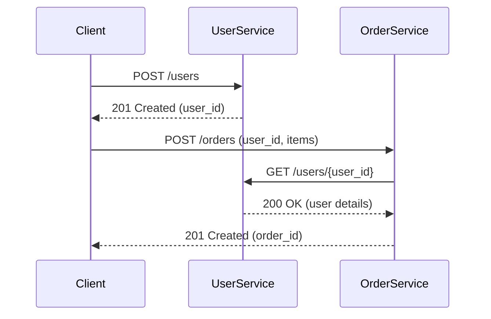

## Architecture Overview

### At a Glance

- **User Service (`user-service`)**
  - Responsibility: Manage user profiles.
  - Stack: Python 3.12, FastAPI, Pydantic.
  - Storage: SQLite database (`user_service.db`) owned exclusively by the service.
  - Port: 8000.
  - REST API Highlights:
    - `POST /users` – create a user.
    - `GET /users/{user_id}` – fetch user details.
    - `GET /users` – list users.
    - `PUT /users/{user_id}` – update user details.
    - `DELETE /users/{user_id}` – remove a user.

- **Order Service (`order-service`)**
  - Responsibility: Manage orders and validate the requesting user.
  - Stack: Python 3.12, FastAPI, Pydantic, `httpx` for cross-service communication.
  - Storage: SQLite database (`order_service.db`) owned exclusively by the service.
  - Port: 8001.
  - REST API Highlights:
    - `POST /orders` – create an order for a user.
    - `GET /orders/{order_id}` – fetch order details.
    - `GET /orders` – list orders.

### Service Interaction

The order service performs a simple validation step by invoking the user service over HTTP before persisting an order.

### Local Deployment (Docker Compose)

Docker Compose provides a shared bridge network (the Compose default) so the services discover each other via DNS and isolates their data stores via named volumes.

- `user-service` container name: `user-service`
- `order-service` container name: `order-service`

Environment variables configure service dependencies:

- `USER_DB_PATH=/home/appuser/app/data/user_service.db`
- `ORDER_DB_PATH=/home/appuser/app/data/order_service.db`
- `USER_SERVICE_URL=http://user-service:8000`

### Security & Extensibility Notes

- Docker images run with a non-root user.
- Configuration is injected via environment variables to avoid hard-coding secrets.
- Each service owns its storage and can evolve independently (e.g., swap in PostgreSQL, MongoDB).
- In future phases, replace in-memory stores with persistent databases and register services with Kubernetes DNS.

### Testing Strategy

- Unit tests cover HTTP route behavior using FastAPI `TestClient`.
- Integration test (`services/order-service/tests/test_main.py::test_create_order_with_user_service_integration`) spins up the user service with SQLite and exercises the order workflow end-to-end through real HTTP calls.
- Docker Compose enables additional smoke testing with tools such as `curl` or Postman.

